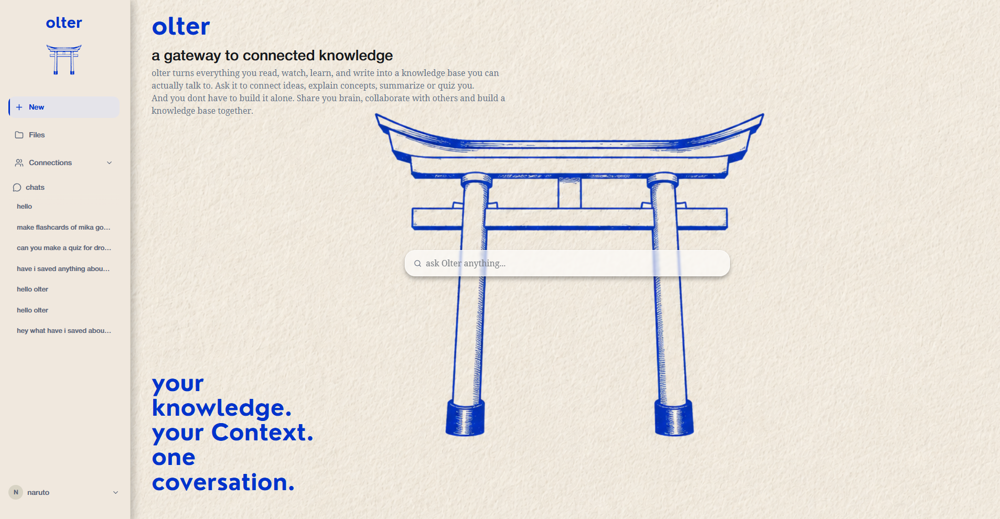
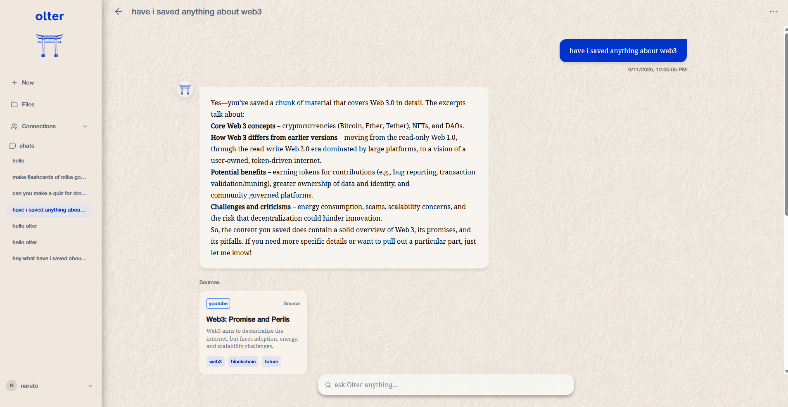
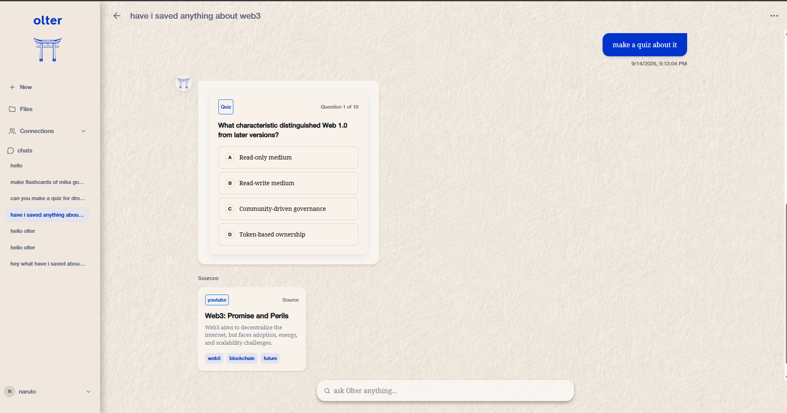
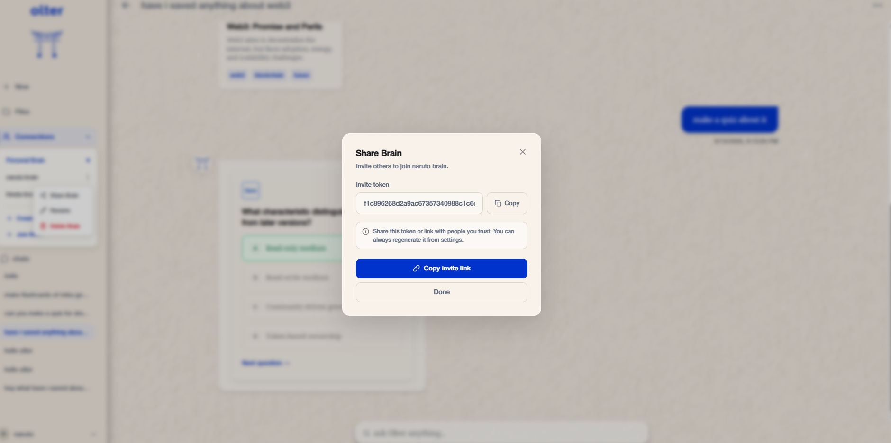
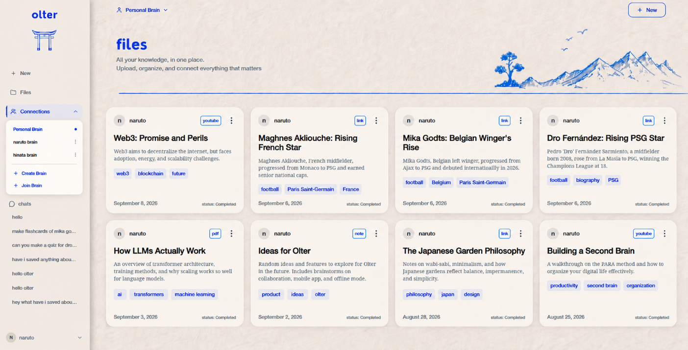

# Olter

<p align="center">
  <strong>Your knowledge. Your context. One conversation.</strong>
</p>

<p align="center">
  A personal knowledge base where your saved information becomes context
  for AI-powered conversations, summaries, quizzes, and flashcards.
</p>

<p align="center">
  <a href="https://olter-mrvg.vercel.app">
    <strong>🚀 Try Olter Live</strong>
  </a>
</p>

<p align="center">
  
</p>

---

## 🧠 What is Olter?

Olter is a personal knowledge management and second-brain application designed to turn scattered information into an organized, interactive knowledge base.

Instead of simply storing information, Olter allows users to **interact with their saved knowledge** through context-aware AI conversations and specialized learning tools.

Users can organize their knowledge into separate spaces called **Brains**, save content inside them, and use that content as context for AI-powered conversations, summaries, quizzes, and flashcards.

---

## ✨ Features

### 🧠 Brains

Brains are the core organizational unit of Olter.

Instead of keeping all saved information in one collection, users can organize their knowledge into separate, focused spaces — such as a Personal Brain, a project-specific Brain, or a shared Brain with other users.

Each Brain has its own collection of saved content, allowing conversations and AI operations to remain focused on the knowledge relevant to that context.

Brains can also be shared with other users through invite tokens.

**Brain owners can:**

- Create Brains
- Share Brains
- Delete Brains
- Rename Brains

**Brain members can:**

- Join shared Brains
- Access shared knowledge
- Leave Brains

This allows Olter to function both as a private knowledge base and as a collaborative space for building knowledge with others.

---

### 🤖 AI-Powered Actions

Olter goes beyond simply storing information by allowing users to interact with their saved knowledge through AI-powered conversations.

Conversations can use the content stored within the currently selected Brain as context, allowing users to ask questions and retrieve information from their own knowledge base rather than relying solely on general AI knowledge.

Olter also provides specialized AI actions for working with saved content.

#### Ask Questions

Have contextual conversations grounded in your saved knowledge.

<p align="center">
  
</p>

#### Summarize

Turn selected saved content into concise summaries that make large amounts of information easier to understand.

#### Generate Quizzes

Automatically generate quizzes from saved content, including:

- Questions
- Multiple-choice options
- Correct answers
- Explanations

<p align="center">
  
</p>

#### Generate Flashcards

Transform saved content into question-and-answer flashcards for revision and active recall.

These actions turn a collection of saved information into something that can be actively explored, understood, and learned from.

---

## 💬 Context-Aware Conversations

Olter's chat system is designed around the idea that your saved knowledge should be the context for your conversations.

When a conversation is created, it is associated with a specific Brain. Subsequent messages in that conversation use the Brain associated with the chat, allowing the backend to retrieve relevant knowledge without requiring the client to repeatedly specify the Brain.

This creates a consistent relationship between:

```text
Brain
│
├── Saved Content
│
└── Conversations
    │
    ├── Questions
    ├── Summaries
    ├── Quizzes
    └── Flashcards
```

This architecture keeps the conversation tied to the knowledge context it was created for.

---

## 👥 Collaborative Knowledge

Brains can be shared between users through invite tokens.

A Brain owner can generate a share token and provide it to another user. The recipient can use the token to join the Brain and gain access to its shared knowledge.

<p align="center">
  
</p>

The Brain system maintains ownership and membership separately, allowing Olter to distinguish between:

- Brain owners
- Brain members
- Personal knowledge
- Shared knowledge

This makes it possible to use Olter for both individual knowledge management and collaborative knowledge spaces.

---

## 📚 Knowledge Organization

Saved content is organized inside Brains, giving users a focused knowledge space instead of a single global collection.

<p align="center">
  
</p>

Each piece of saved content can provide context for conversations and AI-powered operations.

This creates a workflow where information can move from:

```text
Save
  ↓
Organize
  ↓
Retrieve
  ↓
Interact
  ↓
Learn
```

---

## 🔐 Authentication

Olter uses token-based authentication to protect user accounts and application resources.

Authenticated users can access their own:

- Profile
- Brains
- Saved content
- Conversations
- AI-generated learning material

Protected frontend routes prevent unauthenticated users from accessing the main application.

---

## 🏗️ Architecture

Olter follows a client-server architecture:

```text
                    ┌──────────────────┐
                    │      React       │
                    │    TypeScript    │
                    └────────┬─────────┘
                             │
                             │ HTTP / REST
                             ▼
                    ┌──────────────────┐
                    │     Express      │
                    │      API         │
                    └────────┬─────────┘
                             │
                  ┌──────────┴──────────┐
                  ▼                     ▼
         ┌─────────────────┐   ┌─────────────────┐
         │     MongoDB     │   │    Groq API     │
         │                 │   │                 │
         │ Users           │   │ AI Responses    │
         │ Brains          │   │ Summaries       │
         │ Content         │   │ Quizzes         │
         │ Chats           │   │ Flashcards      │
         └─────────────────┘   └─────────────────┘
```

---

## 🔄 AI Workflow

A typical contextual conversation follows this general flow:

```text
User asks a question
        │
        ▼
      Chat
        │
        ▼
Identify associated Brain
        │
        ▼
Retrieve relevant saved content
        │
        ▼
Build AI context
        │
        ▼
    Groq API
        │
        ▼
Generate response
        │
        ▼
Store response in Chat
        │
        ▼
Display to user
```

Specialized operations such as quizzes and flashcards follow a similar pipeline while producing structured outputs that can be stored and rendered by the frontend.

---

## 🛠️ Tech Stack

### Frontend

- React
- TypeScript
- React Router
- Tailwind CSS
- Framer Motion
- Lucide React
- React Markdown
- remark-gfm

### Backend

- Node.js
- Express
- TypeScript
- MongoDB
- Mongoose
- JWT

### AI

- Groq API
- OpenAI-compatible models

---

## 🚀 Getting Started

### Prerequisites

Make sure you have installed:

- Node.js
- npm
- MongoDB

You will also need a Groq API key.

### Clone the Repository

```bash
git clone https://github.com/zizuaine/olter.git
cd olter
```

### Install Dependencies

Install the dependencies for both the frontend and backend.

```bash
cd frontend
npm install
```

Then:

```bash
cd ../backend
npm install
```

### Environment Variables

Create a `.env` file inside the backend directory and add the required environment variables:

```env
MONGODB_URI=
JWT_SECRET=
GROQ_API_KEY=
```

> Never commit your `.env` file or API keys to the repository.

### Run the Application

Start the backend and frontend development servers according to their respective scripts.

```bash
npm run dev
```

---

## 📸 Screenshots

### Home

<p align="center">
  
</p>

### Knowledge & Brains

<p align="center">
  
</p>

### Context-Aware AI Chat

<p align="center">
  
</p>

### AI-Generated Quiz

<p align="center">
  
</p>

### Brain Collaboration

<p align="center">
  
</p>

---

## 🗺️ Roadmap

- [ ] Improved content management
- [ ] Better semantic search
- [ ] More AI-powered actions
- [ ] Improved collaboration features
- [ ] Production deployment
- [ ] Mobile optimization

---

## 🎯 Why Olter?

Most knowledge-management tools focus on **storing information**.

Olter is built around what happens **after information has been saved**.

The goal is to create a system where your knowledge becomes an active source of context — something you can question, summarize, test yourself on, and learn from.

> Save your knowledge.  
> Give it context.  
> Have a conversation with it.

---

## 📄 License

This project is licensed under the MIT License.